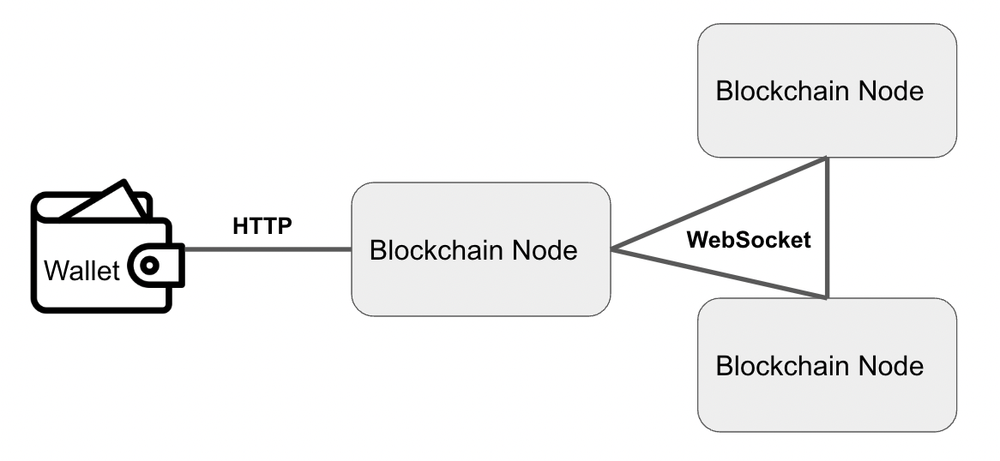

# POS チェーンを作る

前回作った POW のチェーンを POS に改造します。加えて、P2P 通信のモジュールを追加して、前回は集権的にブロックを生成していたところを分散化させます。

## POW チェーンとの変更点

まず、前回のチェーンからの変更部分をリストアップします。前回の POW チェーンから変更した部分をピックアップします。

- コンセンサスを POW に変更
  - POW から POS に変更しました。これに伴って、Stake や Vote 等の POW にはない概念を実装しています。
- アカウントモデルに変更
  - UTXO からアカウントモデルに変更しました。アカウントモデルは Ethereum をはじめ世の POS なブロックチェーンが採用するモデルです。実は、当初は UTXO モデルを使い続ける予定でした。しかし、Stake と Vote を UTXO モデルで表現するのは不自然であったので、より自然な形で実装するためにアカウントモデルを採用しました。
- P2P レイヤの追加
  - 前回は単一の Node がブロックを積み上げる形だったので、他の Node との通信は不要でした。今回は、投票を実現したいので、複数 Node と通信するレイヤーを追加しました。

## POS でブロックを積み上げるステップ

POS はブロックを積み上げるまでに`投票して合意を得る`ことを行います。いくつかのステップを経るので解説します。
今回は投票数１回という最もシンプルな形に簡略化しました。Ethereum や Cosmos のようなパブリックブロックチェーンは複数回投票することで Security を高めています。

- Step1: ブロックのプロポーザを選出
  - 世の中の POS なブロックチェーンでは、ブロックのプロポーザを`Stake量に応じて`、`ブロック高さごとに決定的に選出`します。まず、Proof of Stake という名が示すとおり、Stake 量によってプロポーザに選出される確率が変わります。より Stake 量が多い Node がプロポーザに選ばれすくなります。ポイントは、とあるロジックに従って決定的に選ばれる点です。決定的である理由は、不正を検証するためです。当該ブロック高さのプロポーザを決定的に知れることにより、不正なプロポーザによって生成されたブロックを拒否できます。「とあるロジック」の部分はチェーンによって異なります。今回はブロック高さのハッシュ値を乱数として使っています。
- Step2: プロポーズされたブロックに投票
  - プロポーザに選出されなかった Node は、バリデータとしてブロックを検証する役割を担います。検証結果を投票という形で表明します。今回は、Yes/No の２択とし、検証結果が正であれば Yes に、不正であれば No に投票することにします。
- Step3: 投票の集計
  - プロポーザがバリデータから提出された投票結果を集計します。全体の合意を得られた場合は、正規のブロックをブロードキャストします(Step4 に進む)。今回は全体の 2/3 以上の賛同を得られた場合は、合意されたとみなします。
  - 得られなかった場合は、再度ブロックをプロポーズします（Step1 からやり直し）
- Step4: ブロックのブロードキャスト
  - 合意されたブロックをプロポーザがネットワーク全体に伝播させます。

## 通信プロトコルについて

Tinychain の Node は２つの通信プロトコルを使用しています。
一方は、前回と同じくWallet との通信用の JSON な HTTP です。
もう一方は、P2P 通信用の Websocket です。P2P 通信について詳しく解説します。



### P2P 通信

Blockchain の Node は双方向に通信する必要があります。なぜなら、ブロックのプロポーズや投票は相互に行う必要があるからです。したがって、HTTP のような単方向通信なプロトコルは使えません。また、Node 間の通信はブロックを早く積み上げるためにも、高速であることが求められます。なのでオーバーヘッドの少ないプロトコルが使用されます。チェーンの性能に直結するため GRPC 等のメジャーな規格ではなく、最適化した独自規格を使うチェーンも多いです。今回は、javascript で実装しやすいように Websocket を採用しました。

## アカウントモデルについて

アカウントモデルは、アカウントはとある状態（State）を持っていて、トランザクションによってその State を更新してゆきます。Bitcoin のデータモデルでる UTXO が、更新なしで追加だけのログや履歴のようなものであるのに対して、アカウントモデルは、通常のデータベースのようにデータを上書き更新します。

本実装の State は簡略化していて`balance`と`stake`だけを持ちます。そして`key`によって State はどのアカウントに紐づくのか判断します。key 値として、今回は公開鍵の値をそのまま使います。

```javascript
class State {
  constructor(addr, amount, stake = 0) {
    this.key = addr; // walletのpubkeyをkeyとして使う
    this.balance = amount;
    this.stake = stake; // stakeは簡略化のためGenesisStateからのみ設定する
  }
  ...
}
```

balance は Tinycoin の保有量を表します。プロポーザに与えられるブロック生成報酬や、バリデータのブロック検証報酬は、この balance を増やすことで実現されます。コインの送受信時も、この balance を更新します。
stake はステークされた Tinycoin の量を表します。１コインでも Stake されたらそのアカウントはバリデータであるとみなします。今回は簡略化のため、この stake を更新するしくみを実装していません。[GenesisState](./genesisStates.js)に設定された Stake 量から変動しないものとしています。

State は、Bitcoin や Ethereum 等のバブリックチェーンの場合、`AVL tree等の木構造`で`LevelDBのようなLoweLevelのKey-Valueストアに格納`されます。パフォーマンスを高めるのが目的です。
今回は、単純化のために配列の構造で、メモリ上に保持します。

```javascript
class StateStore {
  constructor(states = []) {
    this.states = states; // stateを配列の形で保持する
  }
  ...
}
```

## トランザクションのライフサイクル

前回と同様にトランザクションのライフサイクルを通して、コードを解説します。
章立てとしては、１から４までは POW の時と同じです。

- Step1: Wallet を作る
- Step2: Transaction を作る
- Step3: Transaction Pool へ Transaction を追加する
- Step4: Block を Transaction Pool 内のトランザクションから作る
- Step5: 投票
- Step6: 投票を集計して正規のブロックを作る
- Step7: ブロックを追加する

### Step1: Wallet を作る

ここは POW と[共通](https://github.com/openreachtech/tinychain/tree/main/pow#step1-wallet-%E3%82%92%E4%BD%9C%E3%82%8B)です。

### Step2: Transaction を作る

アカウントモデルのトランザクションは UTXO と比べるとシンプルです。
未消費のトランザクションを参照する必要がないので「誰から（from）」「誰に(to)」「どれだけ送るか（amount）」の３つの情報が入っているだけです。
トランザクションを区別するために、通常はシークエンシャルにインクリメントされるノンスを入れる必要がありますが、今回は省きました。

```javascript
class Transaction {
  constructor(from, to, amount, sig = "") {
    this.from = from;
    this.to = to;
    this.amount = amount;
    this.signature = sig;
    this.hash = Transaction.hash(from, to, amount);
  }
  ...
}
```

トランザクションに署名して、Tinychain の Node の JSON エンドポイント(`/sendTransaction`)に送ります。

```javascript
// 秘密鍵を読み込んで、ウォレットを作る
const wallet = new Wallet(readWallet(walletPath));
// トランザクションを作り署名する
const tx = wallet.signTx(new Transaction(wallet.pubKey, to, amount));
// トランザクションをNodeのJSONエンドポイントへ送る
await axios.post(`http://localhost:3001/sendTransaction`, tx);
```

### Step3: Transaction Pool へ Transaction を追加する

POW と同様にバリデーションを行い、正しいトランザクションのみをプールへ追加します。
前回と異なるのは`pendingStates`への apply の部分です。

```javascript
class TxPool {
  constructor(states) {
    this.txs = [];
    this.pendingStates = states;
  }

  addTx(tx) {
    TxPool.validateTx(tx, this.pendingStates);
    if (this.txs.find((t) => t.hash === tx.hash)) return false; // 新規のTxではない
    this.pendingStates = StateStore.applyTransaction(this.pendingStates, tx);
    this.txs.push(tx);
    return true;
  }
  ...
}
```

トランザクションプールに、ペンディング状態の States を保持しておいて、トランザクションが追加される度に更新します。

```javascript
class StateStore {
  ...
  static applyTransaction(states, tx) {
    // fromのバランスを更新
    const fromIndex = states.findIndex((state) => state.key === tx.from);
    if (fromIndex < 0) throw new Error(`no state found by key(=${tx.from})`);
    states[fromIndex].updateBalance(-tx.amount);
    // toのバランスを更新
    const toIndex = states.findIndex((state) => state.key === tx.to);
    if (toIndex < 0) {
      states.push(new State(tx.to, tx.amount)); // stateを新規追加
    } else {
      states[toIndex].updateBalance(tx.amount); // stateを更新
    }
    return states;
  }
  ...
}
```

これはトランザクションの検証時に、送金額がペンディング状態の残高以下であることを確認するためです。

```javascript
static validateTx(tx, states) {
  ....
  // 送金額が残高以下であるかチェック
  const balance = states.find((s) => s.key === tx.from).balance;
  if (balance < tx.amount) {
    throw new Error(`insufficient fund(=${balance})`);
  }
}
```

### Step4: Block を Transaction Pool 内のトランザクションから作る

Tinychain を立ち上げると、この部分が 10 秒間隔で定期実行されます。
自身が次のブロック高さのブロックプロポーザである場合、Tx プールのトランザクションをまとめて、ブロックを作り、ブロードキャストします。

```javascript
class Tinychain {
  ...
  start(broadcastBlock) {
    setInterval(() => {
      if (!this.isProposer()) return; // 自分がproposerでなければスキップ
      if (this.pendingBlock) return; // 既にブロックをプロポーズ済みならスキップ
      // 自分がproposerならブロックを作ってブロードキャスト
      this.pendingBlock = this.generateBlock();
      broadcastBlock(this.pendingBlock);
      console.log(`proposing ${this.pendingBlock.height} th height of block`);
    }, 10 * 1000); // 10秒間隔で実行する
  }
}
```

プロポーザの選出は、ブロック高さから決定的に決まります。

1. まず、ブロック高さのハッシュ値の先頭 1byte（`0x${SHA256(height.toString()).toString().slice(0, 2)`）を計算します
2. 次に、stake 量の総和を計算します
3. そして、stake 量によって荷重された VotingPower を計算します。255 で掛けているのは、今回、乱数としてつかった 1byte の最大値が 255 であり、その割合を出すためです。
4. バリデータをイテレートするなかで、初めて VotingPower の総和が、ブロック高さから求めた乱数（threshold）を超えた時のバリデータをプロポーザとして選出します

```javascript
class Tinychain {
  ...
  electProposer(validators, height) {
    // 1. ブロック高さのハッシュ値の先頭１byteを決定的な乱数として使う
    const threshold = Number(`0x${SHA256(height.toString()).toString().slice(0, 2)}`);
    // 2. Stake量の総和を計算
    const totalStake = validators.reduce((pre, v) => pre + v.stake, 0);
    let sumOfVotingPower = 0;
    return validators.find((v) => {
      // 3. stake量によって荷重されたVotingPowerを計算stake量によって荷重されたVotingPowerを計算
      //    255で掛けているのは、今回、乱数としてつかった1byteの最大値が255であり、その割合を出すため
      let votingPower = 255 * (v.stake / totalStake);
      sumOfVotingPower += votingPower;
      // 4. 初めてVotingPowerの総和が、ブロック高さから求めた乱数（threshold）を超えた時のバリデータをプロポーザとして選出
      return threshold <= sumOfVotingPower;
    }).key;
  }
  ...
}
```

### Step5: 投票
プロポーズされたブロックを受信したら、検証して正しい場合は Yes に、不正の場合は No に投票します。

```javascript
class P2P {
  handleMessage(socket) {
    ...
    socket.on("message", (data) => {
      switch (packet.type) {
        ...
        // プロポーズブロックを受信した場合は、検証して正しい場合はYesに、不正の場合はNoに投票する
        case PacketTypes.PBlock: {
          const txs = packet.txs.map((t) => new Transaction(t.from, t.to, Number(t.amount), t.signature));
          const b = new Block(packet.height, packet.preHash, packet.timestamp, txs, packet.proposer, packet.stateRoot);
          // プロポーザーなら投票には参加しない
          if (self.chain.isProposer()) break;
          // 既に同じブロックに投票済みならスキップ
          if (self.chain.votes.find((v) => v.blockHash === b.hash && v.voter === self.wallet.pubKey)) {
            break;
          }
          // プロポーズされたブロックをブロードキャスト
          self.sockets.forEach((s) => s.send(data));
          console.log(`received ${b.height} th height of proposed block`);

          // 正しいブロックなら yes に 不正なブロックなら no に投票
          let isYes;
          try {
            self.chain.validateBlock(b);
            isYes = true; // validなブロックの場合は、yes vote
          } catch (e) {
            console.log(e);
            isYes = false; // invalidなブロックの場合は、no vote
          }

          // Voteを作ってブロードキャスト
          const v = self.wallet.signVote(new Vote(b.height, b.hash, self.wallet.pubKey, isYes));
          self.chain.addVote(v); // 自身に追加
          self.sockets.forEach((s) =>
            s.send(
              JSON.stringify({
                type: PacketTypes.Vote,
                height: v.height,
                blockHash: v.blockHash,
                voter: v.voter,
                isYes: v.isYes,
                signature: v.signature,
              })
            )
          );
          console.log(`voted ${v.isYes ? "yes" : "no"} to proposed block`);
          break;
        }
      ...
      }
    }
  }
}
```

ブロックの検証は、前回と共通する部分が多いです。
`StateRootの計算結果が一致するかチェック`この部分が POS らしいです。

```javascript
class Tinychain {
  ...
  validateBlock(b, isApproved = false) {
    const preBlock = this.latestBlock();
    const expectedProposer = this.electProposer(this.store.validators(), b.height);
    const states = StateStore.applyTransactions(this.store.states, b.txs);
    const expectedStateRoot = StateStore.computeStateRoot(states);
    const expHash = Block.hash(b.height, b.preHash, b.timestamp, b.txs, b.proposer, b.stateRoot, b.votes);
    if (b.height !== preBlock.height + 1) {
      // ブロック高さが直前のブロックの次であるかチェック
      throw new Error(`invalid heigh. expected: ${preBlock.height + 1}`);
    } else if (b.preHash !== preBlock.hash) {
      // 前ブロックハッシュ値が直前のブロックのハッシュ値と一致するかチェック
      throw new Error(`invalid preHash. expected: ${preBlock.hash}`);
    } else if (b.proposer !== expectedProposer) {
      // 正しいブロッックプロポーザーかチェック
      throw new Error(`invalid propoer. expected: ${expectedProposer}`);
    } else if (b.stateRoot !== expectedStateRoot) {
      // StateRootの計算結果が一致するかチェック
      throw new Error(`invalid state root. expected: ${expectedStateRoot}`);
    } else if (b.hash !== expHash) {
      // ハッシュ値が正しいく計算されているかチェック
      throw new Error(`invalid hash. expected: ${expHash}`);
    }
    Block.validateSig(b); // 署名が正しいかチェック
    // 承認されたブロックの場合は、2/3以上のyesを集めているかチェック
    if (isApproved) {
      if (!this.tallyVotes(b.votes)) {
        throw new Error(`insufficient positive votes`);
      }
    }
  }
  ...
}
```

パブリックブロックチェーンでは、StateRoot は木構造で保持された States の Root 値です。
今回は、簡略化のため State を配列の形で保持しているので、単純に`全statesを文字列にして繋げたもののhash値`で代替します。

```javascript
class StateStore {
  ...
  static computeStateRoot(states) {
    // StateRootは「全statesを文字列にして繋げたもののhash値」とする
    return SHA256(states.reduce((pre, state) => pre + state.toString(), "")).toString();
  }
}
```

### Step6: 投票を集計して正規のブロックを作る

自信がブロックプロポーザであり、受信した投票が規定の数に達したら、集計して、賛同を得られた場合は、正規のブロックを作り、ブロードキャストします。

```javascript
class P2P {
  handleMessage(socket) {
    ...
    socket.on("message", (data) => {
      switch (packet.type) {
        ...
        // 投票を受信した場合、votesに追加
        // 自分がプロポーザで2/3以上の賛同を得られた場合は、確定ブロックをブロードキャスト
        case PacketTypes.Vote:
          try {
            const vote = new Vote(packet.height, packet.blockHash, packet.voter, packet.isYes, packet.signature);
            const isNew = self.chain.addVote(vote); // voteを自身に追加
            if (!isNew) break; // 新しいvoteでない場合は、ブロードキャストしない
            console.log(`succeed adding vote ${vote.hash}`);
            self.sockets.forEach((s) => s.send(data)); // 接続しているPeerにブロードキャスト
            if (!self.chain.isProposer()) break;

            // 自分がプロポーザの場合は、投票を集計する
            if (self.chain.votes.length !== self.chain.store.validators().length - 1) break; // 投票率が100%かチェック
            if (!self.chain.tallyVotes(self.chain.votes)) {
              // 2/3以上の賛同を得られなければ、ブロックを作り直す
              self.chain.proposeBlock = null;
              self.chain.votes = [];
              break;
            }

            // 2/3以上の賛同を得られれば、得票したらブロックにsignしてブロードキャスト
            console.log(`proposed block was accepted!`);
            let b = self.chain.pendingBlock;
            const newBlock = self.wallet.signBlock(
              new Block(b.height, b.preHash, b.timestamp, b.txs, b.proposer, b.stateRoot, self.chain.votes)
            );
            self.chain.addBlock(newBlock);
            self.sockets.forEach((s) =>
              s.send(
                JSON.stringify({
                  type: PacketTypes.Block,
                  height: newBlock.height,
                  preHash: newBlock.preHash,
                  timestamp: newBlock.timestamp,
                  txs: newBlock.txs,
                  proposer: newBlock.proposer,
                  stateRoot: newBlock.stateRoot,
                  votes: newBlock.votes,
                  signature: newBlock.signature,
                })
              )
            );
          } catch (e) {
            console.error(e);
            break;
          }
          break;
      ...
      }
    }
  }
}
```

何をもって合意を得られたと定義するかはPOS のチェーンに拠ります。
今回は`yesの投票がバリデータ数の2/3以上であること`を合意の条件とします。

```javascript
class Tinychain {
  tallyVotes(votes) {
    const rate = votes.filter((v) => v.isYes).length / (this.store.validators().length - 1); // yes投票の割合
    return 2 / 3 <= rate; // yesが2/3以上であれば合格
  }
```

### Step7: ブロックを追加する

最後に、正規のブロックをチェーンに追加します。

```javascript
class Tinychain {
  ...
  addBlock(newBlock) {
    let isNew = this.latestBlock().height < newBlock.height ? true : false;
    if (!isNew) return false; // 新規のブロックでない場合はスキップ
    this.validateBlock(newBlock, true);
    this.blocks.push(newBlock);
    this.store.states = StateStore.applyTransactions(this.store.states, newBlock.txs); // stateの更新
    this.store.applyRewards(newBlock.proposer, newBlock.votes); // リワードの付与
    this.pool.clear(this.store.states); // ペンディングTxsとStatesのクリア
    this.votes = []; // 投票のクリア
    this.pendingBlock = null; // ペンディングBlockのクリア
    console.log(`> ⛓ new block added! height is ${newBlock.height}`)
    return true;
  }
  ..
}
```

この時に、ブロックの生成報酬を分配します。
プロポーザには３枚の Tinycoin を付与し、バリデータには１枚を付与します。

```javascript
class StateStore {
  ...
  applyRewards(propoer, votes) {
    // proposerのリワードは”３”
    this.states[this.states.findIndex((s) => s.key === propoer)].balance += 3;
    // yesに投票したvoterのリワードは”１”
    votes
      .filter((v) => v.isYes)
      .map((v) => v.voter)
      .forEach((voter) => {
        this.states[this.states.findIndex((s) => s.key === voter)].balance += 1;
      });
  }
  ...
}
```

## 動作確認
チェーンを立ち上げて動作確認をします。
まずは、３台のNodeを立ち上げます。ブロックを積み上げるには2/3以上の承認が必要なので、自分以外の２人の承認が必要です。１人でも承認が取れないと、ブロックを積み上げることができません。

```sh
# start alice's node
node server.js chain --wallet ./wallet/privkey-alice -p 3001 --p2p-port 5001
# start bob's node
node server.js chain --wallet ./wallet/privkey-bob -p 3002 --p2p-port 5002 --p2p-endpoints ws://127.0.0.1:5001
# start tom's node
node server.js chain --wallet ./wallet/privkey-tom -p 3003 --p2p-port 5003 --p2p-endpoints ws://127.0.0.1:5001
```

Aliceの残高を確認してみます。ブロックが積み上がる毎に、増えるのがわかります。
```sh
# balance of alice
node client.js balance -p 3001 0463f71fdd303538611a58bae6963ca358d17e56c1990d9456f553d90ad774ebb2c0be5ac43be6e4decc51a3a2cb2d4305aa1524ff55a69f78dfa7459189f3af6b
```

Aliceからコインを送金してみます。
ブロックが積み上がったら、残高が１になっていることが確認できます。
```sh
# transfer coin
node client.js transfer -w ./wallet/privkey-alice -p 3001 -a 1 04a4311e7c68d6bb1be8a6db813cacec2b4e357c3289b113b3530f92fd1045b2b03d94dc8066671a5215e4abb5f1dcbd786ea73a25f67bf64bad68e493db551473

# confirm balance
node client.js balance -p 3001 04a4311e7c68d6bb1be8a6db813cacec2b4e357c3289b113b3530f92fd1045b2b03d94dc8066671a5215e4abb5f1dcbd786ea73a25f67bf64bad68e493db551473
{ balance: 1 }
```
