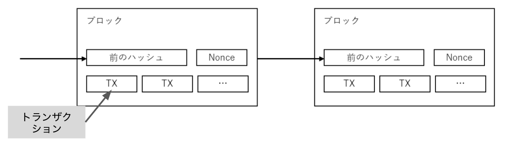

# Bitcoin のような POW チェーンを作る

ブロックチェーンの始祖たる Bitcoin にはブロックチェーンのエッセンスが詰まっています。Bitcoin を深く理解することが、ブロックチェーンの解像度を高める一番の近道だと思っています。
ということで、今回は Bitcoin のような Tinycoin を実装します。

## Tinycoin の仕様解説

実際の Bitcoin と異なる簡略化した部分を中心に解説します。

- １つのトランザクションで１つのコインを送る
  - 通常のトランザクションは、１つのトランザクションで複数のコインを送れます。また、複数人に送ることも可能です。しかし、Tinycoin では簡略化して`自分の持ってる１枚のコインを誰かに送る`とします
- POW 風なコンセンサス
  - Bitcoin の POW をそのまま実装すると、コンピューターリソースを消費してしまうので、POW を模したような実装をします。8 秒に１回だけランダムにブロックが生成されます。
- １つの Node が集権的にブロックを生成する
  - ブロックチェーンは分散性が肝です。今回は簡略化してとある Node が集権的にブロックを生成するとします。

## トランザクションのライフサイクル

トランザクションを作り、ブロックに取り込まれる一連の流れを解説します。

- Step1: Wallet を作る
- Step2: Transaction を作る
- Step3: Transaction Pool へ Transaction を追加する
- Step4: Block を Transaction Pool 内のトランザクションから作る
- Step5: マイニング
- Step6: Blockをチェーンへ追加

### Step1: Wallet を作る

今回作る Wallet は秘密鍵を持ち、トランザクションに署名するだけの簡単なものです。
`EC.genKeyPair()`で秘密鍵を生成して、`key.sign(tx.hash)`でトランザクションに署名します。
Bitcoin のアドレスは公開鍵からとある関数を通すことで生成されますが、今回は、公開鍵をそのままアドレスとして代用します。

```javascript
const wallet = new Wallet();

class Wallet {
  constructor(key) {
    this.key = key ? key : EC.genKeyPair(); // 秘密鍵の生成
    this.pubKey = this.key.getPublic().encode("hex"); // この公開鍵をアドレスとして使う
  }
  // トランザクションに署名する関数
  signTx(tx) {
    tx.inSig = toHexString(this.key.sign(tx.hash).toDER());
    return tx;
  }
}
```

### Step2: Transaction を作る

トランザクションは`未消費のトランザクションのハッシュ値（inHash）`、`署名（sig）`、`受取り手アドレス（outAddr）`、`トランザクションのハッシュ値（hash）`の４要素で構成されます。

```javascript
class Transaction {
  constructor(inHash, outAddr, sig = "") {
    this.inHash = inHash;
    this.inSig = sig;
    this.outAddr = outAddr;
    this.hash = Transaction.hash(inHash, outAddr);
  }
  ...
}
```

トランザクションは、前のトランザクションのハッシュ値を含むことで、数珠繋ぎになっています。まだ繋がっていないトランザクションが未消費のトランザクション（Unspent Transaction）です。この未消費のトランザクションの総和が自分の持っているコインの総和です。

トランザクションは必ず自分のウォレット（秘密鍵）で署名をしなければいけません。
未消費トランザクションが、自分のものであるこを証明するためです。

```javascript
let tx = new Transaction(unspentTransaction.hash, recipientAddress);
// 署名の作成
tx = wallet.signTx(tx);
```

具体的には、未消費トランザクションの受取り手アドレス（outAddr）が、トランザクションハッシュ値の署名に等しいことを確認します。

```javascript
const key = EC.keyFromPublic(UnspentTx.outAddr, "hex");
// 署名の検証
key.verify(tx.hash, tx.inSig);
```

### Step3: Transaction Pool へ Transaction を追加する

ブロックチェーンの Node に送られたトランザクションはトランザクションプールに格納されます。
トランザクションプールは「まだブロックに取り込まれていないトランザクションの集合」です。
後々、ブロックに追加されますが、まずは、トランザクションプールにプールされます。

```javascript

// トランザクションをPoolに追加
pool.addTx(tx);

class TxPool {
  constructor() {
    this.txs = [];
    this.unspentTxs = [];
  }

  addTx(tx) {
    TxPool.validateTx(this.unspentTxs, tx);
    this.txs.push(tx);
  }
  ...
}
```

不正なトランザクションをプールしておくのはリソースの無駄遣いなので、追加する前に検証されます。
検証内容は次の３点です。
- hash値が正しく計算されているか
- 消費済みトランザクションではないか（未消費のトランザクションであること確認）
- 署名が正当かどうか

```javascript
static validateTx(unspentTxs, tx) {
  // hash値が正しく計算されているかチェック
  if (tx.hash !== Transaction.hash(tx.inHash, tx.outAddr)) {
    throw new Error(`invalid tx hash. expected: ${Transaction.hash(tx.inHash, tx.outAddr)}`);
  }
  // 消費済みトランザクションではないか（未消費のトランザクションであること確認）チェック
  const inTx = unspentTxs.find((unspentTx) => unspentTx.hash === tx.inHash);
  if (!inTx) throw new Error(`tx in not found`);
  // 署名が正当かどうかチェック
  if (!TxPool.validateSig(tx, inTx.outAddr)) {
    throw new Error(`invalid signature`);
  }
}
```

### Step4: Block を Transaction Pool 内のトランザクションから作る
ブロックチェーンのブロックは、トランザクションの容器のようなものです。トランザクションプール内のトランザクションのうち、手数料を割高に設定されたものから優先的に抽出されます。
今回は手数料の概念を省略しているので、トランザクションプール内の全てを取り込む実装にしています。

通常、ブロックはブロックヘッダーと中身に分けられるのですが、今回は簡略化のため分けていません。
ブロックは`ブロック高さ(height)`、`直前ブロックのハッシュ値(preHash)`、`タイスタンプ(timestamp)`、`トランザクションデータ(data)`、`ノンス(nonce)`、`ブロックのハッシュ値(hash)`の６要素で構成されます。
```javascript
class Block {
  constructor(height, preHash, timestamp, data, nonce) {
    this.height = height;
    this.preHash = preHash;
    this.timestamp = timestamp;
    this.data = data;
    this.nonce = nonce;
    this.hash = Block.hash(height, preHash, timestamp, data, nonce);
  }
  ...
}
```

ブロックもトランザクションと同じく数珠繋ぎな構成になっています。まさに、ブロックがチェーンのように繋がっています。
前のブロックのハッシュ値（preHash）を持つことで、繋げています。

トランザクションはシリアライズ化されてdataに格納されます。通常はトランザクションはMerkle Treeの形で格納されますが、今回は簡略しています。

ノンスは、任意の数値で、POWのブロック要件を満たすために使われる値です。
ブロックの要件とは「ブロックのハッシュ値の先頭ゼロbit数ががdifficulty以上であること」です。
この要件を満たすためにノンス値を何度も変更して、要件を満たすブロックを探す作業をマイニングといいます。


### Step5: マイニング

マイニングを簡略化した形で実装しました。
Noceをインクリメンとして、hex表記のブロックのハッシュ値の先頭に、ゼロがdifficulty個以上並ぶか確かめる作業を、１秒間に32回行います。difficultyが2の場合、ブロックハッシュの先頭にゼロが２つ並ぶ確率は、1/256なので、８秒に一回の確率で正しいブロックが生成されます。
```javascript
const intervalID = setInterval(() => {
  const data = this.pool.txs.reduce(
    (pre, tx) => pre + tx.toString(),
    conbaseTx.toString()
  );
  // ブロックを生成
  const block = new Block(pre.height + 1, pre.hash, now(), data, nonce);
  // hash値のhexの先頭に'0'が'difficulty'個以上つけば正規のブロックになる
  if (block.hash.startsWith("0".repeat(this.difficulty))) {
    clearInterval(intervalID);
    // NOTE: タイミング次第でバグとなりうる危険なコード
    // 全てのUtxoがブロックに取り込まれたとしtxpoolを空にする
    const spentTxs = this.pool.txs;
    this.pool.txs = [];
    this.pool.updateUnspentTxs(spentTxs);
    this.pool.unspentTxs.push(conbaseTx);
    resolve(block);
  }
  nonce++; // nonceをインクリメントすることで、hash値に変化をつける
  // difficulty=2の場合、先頭にゼロが２つ揃う確率は、1/256
  // 1秒に32回試行するなら、256/32=8秒に一回だけブロックを生成する
}, 1000 / 32);
```

### Step6: Blockをチェーンへ追加

マイニングを行い、正しいブロックを発見したらそのブロックをチェーンに追加します。
具体的には`blocks`という配列に追加します。
通常のブロックチェーンでは正しいブロックを見つけたら、P2Pで繋がっている別のNodeに伝播します。今回はブロックチェーンNodeは１つか存在さず、集権的にブロックを積み上げるものとしました。
```javascript
class Tinycoin {
  constructor(wallet, difficulty = 2) {
    this.blocks = [genesisBlock()];
    this.pool = new TxPool();
    this.wallet = wallet ? wallet : new Wallet(); // コインベースTxを受け取るウォレット
    this.difficulty = difficulty;
    this.stopFlg = false;
  }

  addBlock(newBlock) {
    this._validBlock(newBlock);
    this.blocks.push(newBlock);
  }
  ...
}
```

ブロックを追加する前には次の４点をチェックします。
- ブロック高さが直前のブロックの次であるか
- 前ブロックハッシュ値が直前のブロックのハッシュ値と一致するか
- ハッシュ値が正しいく計算されているか
- difficultyの要件を満たすか
```javascript
_validBlock(block) {
  ...
  if (preBlock.height + 1 !== block.height) {
    // ブロック高さが直前のブロックの次であるかチェック
    throw new Error(`invalid heigh. expected: ${preBlock.height + 1}`);
  } else if (preBlock.hash !== block.preHash) {
    // 前ブロックハッシュ値が直前のブロックのハッシュ値と一致するかチェック
    throw new Error(`invalid preHash. expected: ${preBlock.hash}`);
  } else if (expHash !== block.hash) {
    // ハッシュ値が正しいく計算されているかチェック
    throw new Error(`invalid hash. expected: ${expHash}`);
  } else if (!block.hash.startsWith("0".repeat(this.difficulty))) {
    // difficultyの要件を満たすかチェック
    throw new Error(`invalid hash. expected to start from ${"0".repeat(this.difficulty)}`);
  }
}
```
